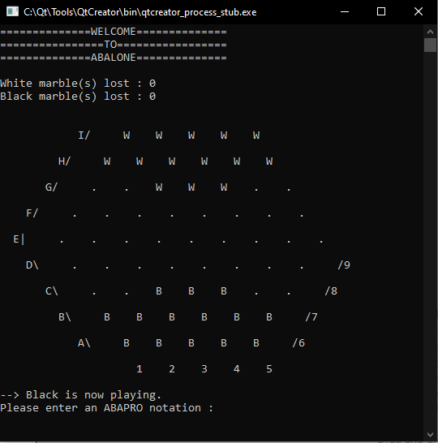
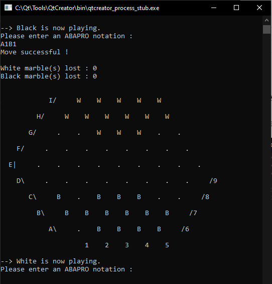
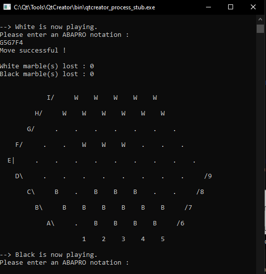

# Abalone 54985 - 54247

Projet de DEV4.

## Participants
- Amine-Ayoub Bigham 54985
- Zakaria Bendaimi 54247

## Infos
- Structure : Qtcreator (subdirs)
- Version C++ : 17
- Version Qt : 5.15.2
- Version QtCreator : 4.14.1 
- OS : Windows 10 20H2 build 19042

## Version Console
Le jeu se présente de cette façon : 

Pour effectuer un mouvement, il vous faut utiliser la **notation ABAPRO**.

Résultat du mouvement `A1B1` (mouvement en ligne) :

Résultat du mouvement `G5G7F4` (mouvement latéral) :

