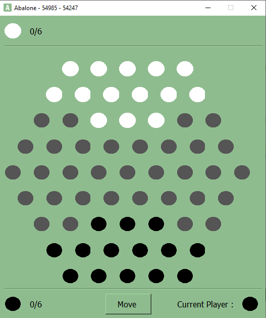

# Abalone 54985 - 54247

School Project (Course: DEV4).

## Authors

- Amine-Ayoub Bigham 54985
- Zakaria Bendaimi 54247

## Infos
 
- C++ Version: 17
- Structure: Qtcreator (subdirs)

## Screenshots

| Version Console                                     | GUI                                             |
| --------------------------------------------------- | ----------------------------------------------- |
|  |  |

- To make a movement on the console version, you must use the ABA-PRO notation when typing on the keyboard.
- For the GUI, select the balls with the mouse while respecting the order and positions of the ABA-PRO notation.