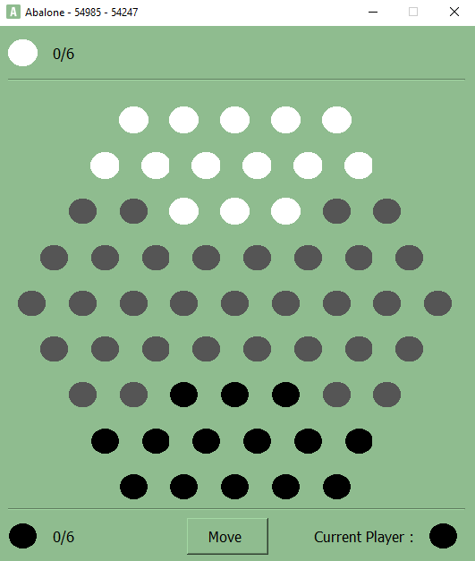

# Abalone 54985 - 54247

Projet de DEV4.

## Infos

- Amine-Ayoub Bigham 54985
- Zakaria Bendaimi 54247
- Structure : Qtcreator (subdirs)
- Version C++ : 17

## Screenshots

| Version Console                                     | GUI                                             |
| --------------------------------------------------- | ----------------------------------------------- |
|  |  |

- Pour effectuer un mouvement sur la version console, il vous faut utiliser la notation ABA-PRO au clavier.
- Pour le gui, sélectionnez les billes avec la souris tout en respectant l'ordre et les positions de la notation ABA-PRO.